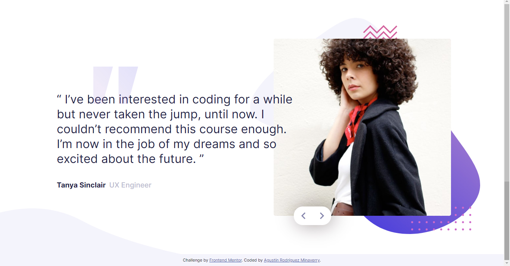

# Frontend Mentor - Coding bootcamp testimonials slider solution

This is a solution to the [Coding bootcamp testimonials slider challenge on Frontend Mentor](https://www.frontendmentor.io/challenges/coding-bootcamp-testimonials-slider-4FNyLA8JL). Frontend Mentor challenges help you improve your coding skills by building realistic projects. 

## Table of contents

- [Overview](#overview)
  - [The challenge](#the-challenge)
  - [Screenshot](#screenshot)
  - [Links](#links)
- [My process](#my-process)
  - [Built with](#built-with)
  - [What I learned](#what-i-learned)
- [Author](#author)

## Overview

### The challenge

Users should be able to:

- View the optimal layout for the component depending on their device's screen size
- Navigate the slider using either their mouse/trackpad or keyboard

### Screenshot

### Links

- Solution URL: [https://github.com/Agujerin/Coding-bootcamp-testimonials-slider]
- Live Site URL: [https://agujerin.github.io/Coding-bootcamp-testimonials-slider/]

## My process

### Built with

- Semantic HTML5 markup
- CSS custom properties
- Flexbox
- Vanilla Javascript

### What I learned

I´d never developed a slideshow before, that´s why I chose this challenge as my first for Frontend Mentor.
I did some research about slideshows but in the end I picked the one that made me fell more comfortable (DOM manipulation with JS and CSS keyframes).

## Author

- Website - [https://agujerin.github.io/CV/]
- Frontend Mentor - [@agujerin](https://www.frontendmentor.io/profile/Agujerin)
- Instagram - [@agujerin]
